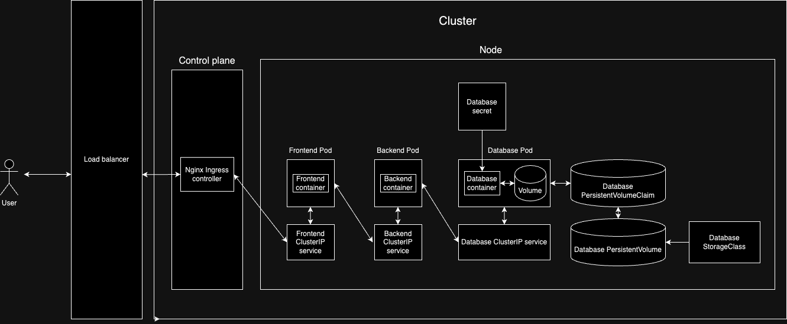

# Helm chart for a fullstack application



## Install a Helm chart (release)

```
helm install <relase name> <chart directory>:
```

## Debugging

_Tunnel traffic from localhost port to the svc/pod/deployment_

```
kubectl port-forward svc/<resource name> <local port>:<target port>
---
kubectl port-forward svc/dev-backend 8000:8000
kubectl port-forward svc/dev-frontend 3000:3000
```

_Shell into the pod_

```
kubectl exec <pod name> -it -- bash
```

_Investigate resource's events and manifest_

```
kubectl describe <resource name>
```

_Test the manifest output by static generation (without hitting kuberenetes API server)_

```
helm template chart --debug
```

_Test the manifest output with hitting kuberenetes API server_

```
helm template chart --debug
```

_Ingress NGINX controller releases_
cd 
```
https://github.com/kubernetes/ingress-nginx/releases
```

_Ingress NGINX controller installation_

```
kubectl apply -f https://raw.githubusercontent.com/kubernetes/ingress-nginx/controller-v1.11.0/deploy/static/provider/cloud/deploy.yaml
```

_Get ingress resources_

```
kubectl get all -n ingress-nginx
```

_Get ingress_

```
kubectl get ing
```

_Inspect ingress_

```
kubectl describe ing
```


